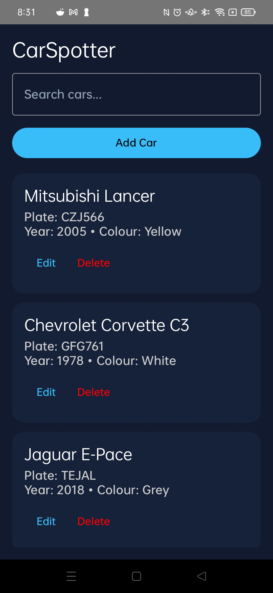
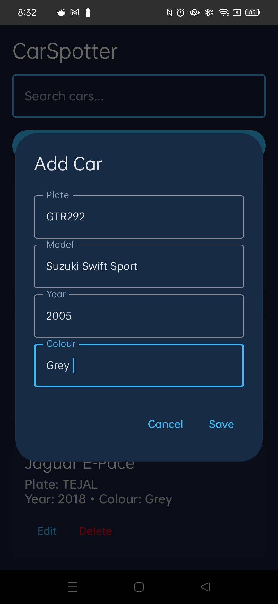
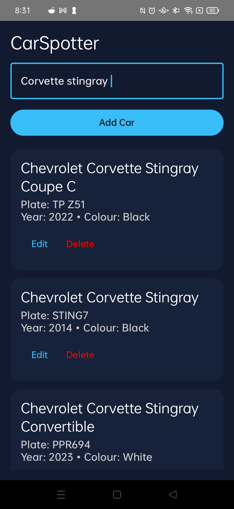

#CarSpotter

A simple Android app to track and store car plates I see.

Features:
- Add/edit/delete cars
- Search system
- Highlights incomplete entries

Built with:
- Kotlin
- Jetpack Compose
- Room Database

## Screenshots

